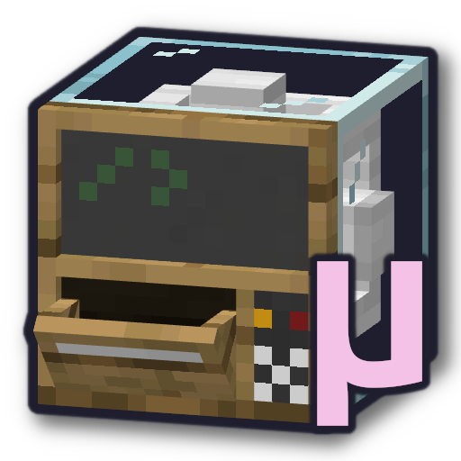

<h3 align="center">
   
  <h2 align="center">μStorage</h2>
  <h5 align="center"><em>"Micro Storage"</em></h5>
  
Simple storage system Minecraft mod

</h3>

### About
This Fabric mod adds three blocks:

- a terminal, which provides a storage GUI for the container it's attached to,
- an interface, which acts as a container for other nearby containers, and
- a trim block which allows connecting more blocks.

Screenshots and icons will be added to this README soon™.

### Inspiration

I'm mainly writing this mod as I find other storage mods too confusing, or have way too many features. [Tom's Simple Storage Mod](https://modrinth.com/mod/toms-storage) was too advanced for me, despite its name lol.

### Dependencies

This mod depends on [Better Runtime Resource Pack](https://modrinth.com/mod/brrp) to dynamically create blocks (incl. models, recipes, drops) as I wanted to maintain compatibility for modded wood types, among other block "variants."
